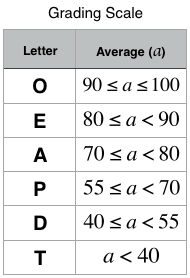

# [Day 12: Inheritance](https://www.hackerrank.com/challenges/30-inheritance/problem)

## Objective
Today, we're delving into Inheritance. Check out the attached [tutorial](https://www.hackerrank.com/challenges/30-inheritance/tutorial) for learning materials and an instructional [video](https://youtu.be/wlA66hZ4Z74)!

## Task
You are given two classes, Person and Student, where Person is the base class and Student is the derived class. Completed code for Person and a declaration for Student are provided for you in the editor. Observe that Student inherits all the properties of Person.

Complete the Student class by writing the following:

* A Student class constructor, which has 4 parameters:
    1. A string, *firstName*.
    2. A string, *lastName*.
    3. An integer, *id*.
    4. An integer array (or vector) of test scores, *scores*.

* A char calculate() method that calculates a Student object's average and returns the grade character representative of their calculated average:

## Input Format
The locked stub code in your editor calls your Student class constructor and passes it the necessary arguments. It also calls the calculate method (which takes no arguments).

You are not responsible for reading the following input from stdin:
The first line contains *firstName*, *lastName*, and *id*, respectively. The second line contains the number of test scores. The third line of space-separated integers describes *scores*.

## Constraints
* *1 <= |firstName|, |lastName| <= 10*
* *len(id) = 7*
* *0 <= score, average <= 100*

## Output Format
This is handled by the locked stub code in your editor. Your output will be correct if your Student class constructor and calculate() method are properly implemented.

## Run
> python3 solution.py